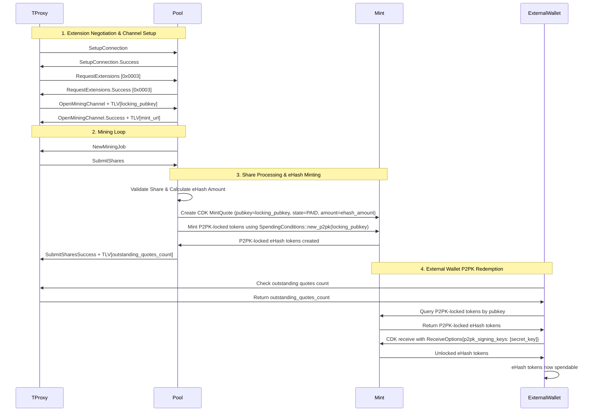
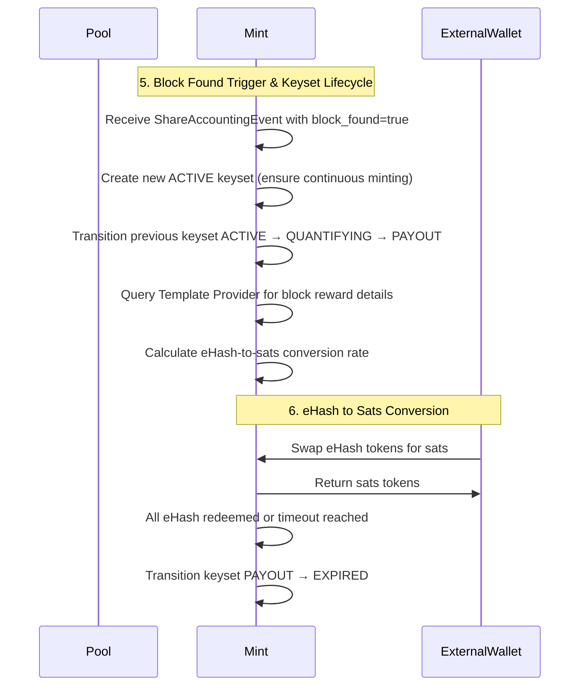
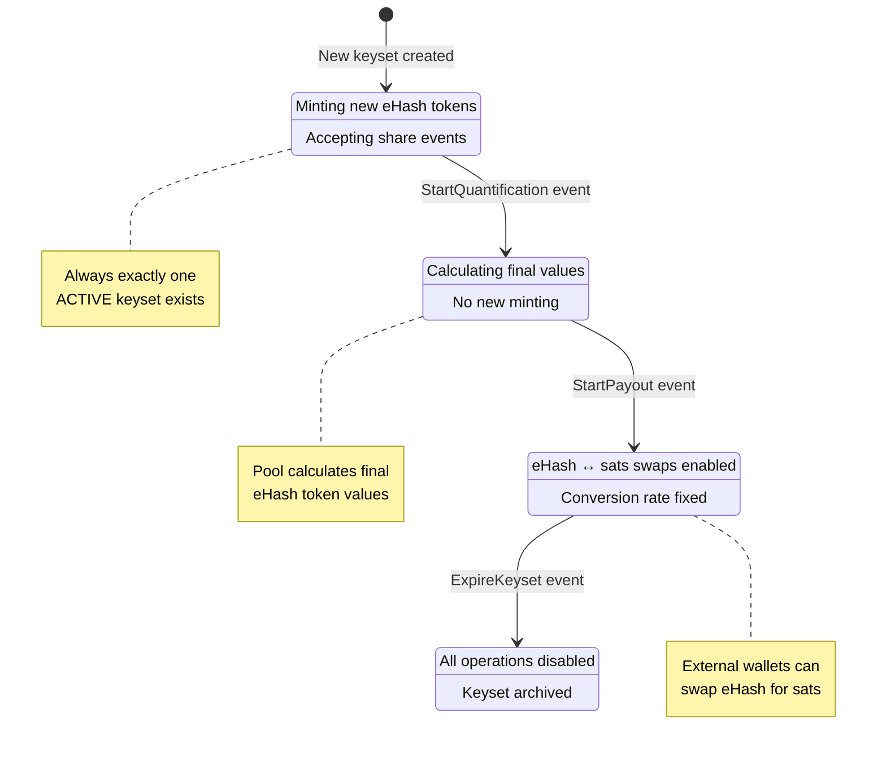

# Design Document

## Overview

This design implements hashpool.dev by integrating Cashu ecash functionality into the Stratum v2 reference implementation. The system adds two new components:

1. **Mint** - A Cashu mint daemon (mool) that replaces the existing file-based share persistence with ecash token minting
2. **Wallet** - A Cashu wallet daemon (walloxy) that automatically redeems ecash tokens based on successful share submissions

The design leverages the existing Stratum v2 architecture patterns and integrates with the CDK (Cashu Development Kit) from the existing git submodule at `deps/cdk`.

## Architecture

### High-Level Component Interaction



### KeySet Sequence Diagram



### Thread Architecture

Following the Pool's existing thread spawning pattern for share persistence:

- **Pool/JDC**: Spawn a Mint thread using `task_manager.spawn()` that receives ShareEvents via async channels
- **TProxy**: Spawn a Wallet thread using the same task manager pattern that receives SubmitSharesSuccess events via async channels

The implementation will mirror the existing `ShareFileHandler` pattern where:
1. A handler struct manages the CDK instance and async channel communication
2. The main role creates the handler and gets sender/receiver channels
3. A background task is spawned via `task_manager.spawn()` to process events
4. The handler implements the `Persistence` trait for compatibility

## Share-to-Mint Correlation Strategy

### Shared Data Analysis

Let's identify what data is common between Pool/JDC (Mool) and TProxy (Wallet):

#### Available in Both Pool/JDC and TProxy:
- `channel_id` - Channel identifier (consistent across the flow)
- `sequence_number` - Share sequence number (from ShareAccountingEvent and SubmitSharesSuccess)
- `user_identity` - Available in Pool, can be derived/configured in TProxy
- `timestamp` - When the share was processed
- `share_work` / `new_shares_sum` - Work value of the shares

#### Available Only in Pool/JDC:
- `share_hash` - The actual hash needed for eHash calculation
- `block_found` - Whether the share found a block
- `total_shares_accepted` - Running total of accepted shares
- `difficulty` / `target` - Mining difficulty information

#### Available Only in TProxy:
- `new_submits_accepted_count` - Count of shares in this batch
- Upstream connection context

### Correlation Strategy: Locking Pubkey + Channel/Sequence Correlation

The system uses both locking pubkeys for authentication and channel/sequence for correlation:
1. **Locking Pubkey**: Configured pubkey exchanged at connection/channel setup for wallet authentication
2. **Channel ID + Sequence Number**: Unique identifier for each share (channel_id, sequence_number)
3. **Quote Creation**: Mint creates PAID quotes associated with locking pubkey and tagged with (channel_id, sequence_number)
4. **Quote Lookup**: Wallet authenticates with locking pubkey and queries for quotes by locking pubkey

### Implementation Approach
```rust
#[derive(Debug, Clone, Hash, PartialEq, Eq)]
pub struct ShareCorrelationKey {
    pub channel_id: u32,
    pub sequence_number: u64,
}

impl ShareCorrelationKey {
    /// Create correlation key from Pool/JDC ShareAccountingEvent
    pub fn from_share_accounting_event(event: &ShareAccountingEvent) -> Self {
        match event {
            ShareAccountingEvent::ShareAccepted { 
                channel_id, 
                user_identity, 
                timestamp,
                .. 
            } => {
                // Use the reintroduced share_sequence_number field
                let sequence_number = share_sequence_number as u64;
                    
                Self {
                    channel_id: *channel_id,
                    sequence_number,
                    user_identity: user_identity.clone(),
                }
            },
            _ => Self::default(),
        }
    }
    
    /// Create correlation key from TProxy SubmitSharesSuccess
    pub fn from_submit_shares_success(
        msg: &SubmitSharesSuccess, 
        user_identity: String
    ) -> Self {
        Self {
            channel_id: msg.channel_id,
            sequence_number: msg.last_sequence_number as u64,
            user_identity,
        }
    }
}
```

## Components and Interfaces

### 1. Shared eHash Module

A new shared module `common/ehash` that provides common types and functionality:

```rust
// common/ehash/src/lib.rs
#[derive(Debug, Clone)]
pub struct ShareEvent {
    pub channel_id: u32,
    pub user_identity: String,
    pub share_work: u64,
    pub share_sequence_number: u64,
    pub timestamp: SystemTime,
    pub block_found: bool,
    // Additional fields for mint payment evaluation
    pub difficulty: f64,
    pub target: U256,
}

// Shared mint handler that can be used by Pool and JDC
pub mod mint;
// Shared wallet handler that can be used by TProxy  
pub mod wallet;
// Common configuration types
pub mod config;
// Common error types
pub mod error;
```

### 2. Mint Component

The Mint component follows the updated `ShareFileHandler` pattern from `stratum-apps`:

```rust
use cdk::{Mint as CdkMint, Amount, nuts::CurrencyUnit};
use stratum_core::channels_sv2::persistence::ShareAccountingEvent;

pub struct MintHandler {
    mint_instance: CdkMint,
    receiver: async_channel::Receiver<ShareAccountingEvent>,
    sender: async_channel::Sender<ShareAccountingEvent>,
    config: MintConfig,
}

impl MintHandler {
    pub async fn new(config: MintConfig) -> Result<Self, MintError>;
    pub fn get_receiver(&self) -> async_channel::Receiver<ShareAccountingEvent>;
    pub fn get_sender(&self) -> async_channel::Sender<ShareAccountingEvent>;
    pub async fn process_share_event(&mut self, event: ShareAccountingEvent) -> Result<(), MintError>;
    // Payment evaluation and minting are internal implementation details
}

#[derive(Clone, Debug)]
pub struct MintPersistence {
    sender: async_channel::Sender<ShareAccountingEvent>,
}
```

### 3. TProxy Share Handler Component

The TProxy manages locking pubkey and share correlation:

```rust
use bitcoin::secp256k1::PublicKey;
use ehash::ShareEvent;

pub struct TProxyShareHandler {
    receiver: async_channel::Receiver<ShareEvent>,
    sender: async_channel::Sender<ShareEvent>,
    config: TProxyShareConfig,
    locking_pubkey: PublicKey,  // Configured locking pubkey for wallet authentication
    user_identity: String,  // Derived from locking pubkey or configured
}

impl TProxyShareHandler {
    pub async fn new(config: TProxyShareConfig) -> Result<Self, TProxyError>;
    pub fn get_receiver(&self) -> async_channel::Receiver<ShareEvent>;
    pub fn get_sender(&self) -> async_channel::Sender<ShareEvent>;
    
    /// Process SubmitSharesSuccess and create ShareEvent with correlation data
    pub async fn process_share_event(&mut self, event: ShareEvent) -> Result<(), TProxyError>;
    
    /// Get locking pubkey for connection/channel setup
    pub fn get_locking_pubkey(&self) -> PublicKey;
    
    /// Get user identity (derived from pubkey or configured)
    pub fn get_user_identity(&self) -> &str;
}
```

### 4. Persistence Integration

The Mint component implements the new `PersistenceHandler` trait to maintain compatibility:

```rust
use stratum_core::channels_sv2::persistence::{Persistence, PersistenceHandler, ShareAccountingEvent};

impl PersistenceHandler for MintPersistence {
    fn persist_event(&self, event: ShareAccountingEvent) {
        let _ = self
            .sender
            .try_send(event)
            .map_err(|e| error!(target = "mint_persistence", "{}", e));
    }
}

#[derive(Clone, Debug)]
pub struct MintPersistence {
    sender: async_channel::Sender<ShareAccountingEvent>,
}

impl MintPersistence {
    pub fn new(sender: async_channel::Sender<ShareAccountingEvent>) -> Self {
        Self { sender }
    }
}

// Integration follows the updated Pool pattern:
// 1. Create MintHandler with config and status_tx
// 2. Get sender/receiver channels from handler  
// 3. Spawn background task via task_manager.spawn()
// 4. Create Persistence::new(Some(MintPersistence::new(sender)))
```

## Data Models

### Configuration Models

Integration with existing Stratum v2 TOML configuration:

```rust
use cdk::{mint_url::MintUrl, nuts::CurrencyUnit, Amount};
use cdk_common::database::MintDatabase;

#[derive(Debug, Deserialize)]
pub struct MintConfig {
    // CDK mint configuration - maps to cdk::Mint::new() parameters
    pub mint_url: MintUrl,  // cdk::mint_url::MintUrl
    pub mint_private_key: Option<String>,  // For cdk::Mint initialization
    pub supported_units: Vec<CurrencyUnit>,  // cdk::nuts::CurrencyUnit (Sat, Msat, custom units)
    
    // CDK database configuration - for cdk::cdk_database::MintDatabase
    pub database_url: Option<String>,  // For CDK database backends (sqlite, postgres, redb)
    
    // Payment logic (hashpool-specific)
    pub min_leading_zeros_delta: u32,  // Delta below network difficulty for minimum eHash (e.g., 8 means min = network_difficulty - 8)
    
    // Integration with existing Stratum v2 config
    pub log_level: Option<String>,
}

#[derive(Debug, Deserialize)]
pub struct TProxyShareConfig {
    // Locking pubkey for wallet authentication
    pub locking_pubkey: String,  // bech32-encoded with 'hpub' prefix (e.g., "hpub1qw508d6qejxtdg4y5r3zarvary0c5xw7k...")
    
    // User identity (optional - can be derived from pubkey)
    pub user_identity: Option<String>,  // User identity to use for channels (defaults to pubkey-derived)
    
    // Mint correlation settings
    pub mint_url: Option<MintUrl>,  // Optional mint URL for external wallet integration
    
    // Integration with existing Stratum v2 config
    pub log_level: Option<String>,
}

// Re-export CDK types for convenience
pub use cdk::nuts::CurrencyUnit as UnitType;
pub use cdk::Amount;
pub use cdk::mint_url::MintUrl;
```

### Event Models and Data Sources

Each role has access to different data structures for generating ShareEvents:

#### Pool Role - ShareAccountingEvent
```rust
// Pool has the richest data from ShareAccountingEvent
// Note: share_sequence_number was removed in recent refactoring
impl From<ShareAccountingEvent> for ShareEvent {
    fn from(event: ShareAccountingEvent) -> Self {
        match event {
            ShareAccountingEvent::ShareAccepted { 
                channel_id, 
                user_identity, 
                share_work,  // Now f64 (difficulty) instead of u64
                share_sequence_number,  // Reintroduced field
                share_hash,
                total_shares_accepted,
                total_share_work_sum,  // Now f64 (sum of difficulties)
                timestamp,
                block_found,
            } => {
                // Generate sequence number from timestamp or use channel-specific counter
                let sequence_number = timestamp.duration_since(std::time::UNIX_EPOCH)
                    .unwrap_or_default().as_secs();
                
                let correlation_key = ShareCorrelationKey {
                    channel_id,
                    sequence_number,
                    user_identity: user_identity.clone(),
                };
                
                ShareEvent {
                    channel_id,
                    user_identity,
                    share_work: share_work as u64, // Convert f64 to u64 for compatibility
                    share_sequence_number: sequence_number,
                    timestamp,
                    block_found,
                    share_hash: Some(share_hash),
                    total_shares_accepted: Some(total_shares_accepted),
                    total_share_work_sum: Some(total_share_work_sum as u64),
                    difficulty: share_work,
                    target: U256::default(), // Extract from context if needed
                    correlation_key,
                }
            },
            ShareAccountingEvent::BestDifficultyUpdated { .. } => {
                // Skip difficulty updates for mint purposes
                ShareEvent::default()
            }
        }
    }
}
```

#### JDC Role - Share Accounting Data
```rust
// JDC has access to share accounting but uses NoPersistence
// Generate ShareEvent from SubmitSharesSuccess context in JDC
impl ShareEvent {
    pub fn from_jdc_context(
        channel_id: u32,
        last_sequence_number: u32,
        new_submits_accepted_count: u32,
        new_shares_sum: u64,
        user_identity: String,
        block_found: bool,
    ) -> Self {
        ShareEvent {
            channel_id,
            user_identity,
            share_work: new_shares_sum,
            share_sequence_number: last_sequence_number as u64,
            timestamp: SystemTime::now(),
            block_found,
            share_hash: None, // Not available in JDC context
            total_shares_accepted: Some(new_submits_accepted_count),
            total_share_work_sum: Some(new_shares_sum),
            difficulty: 0.0,
            target: U256::default(),
        }
    }
}
```

#### TProxy Role - SubmitSharesSuccess
```rust
// TProxy creates ShareEvent with correlation key for wallet redemption
impl ShareEvent {
    pub fn from_submit_shares_success(
        msg: SubmitSharesSuccess, 
        user_identity: String
    ) -> Self {
        let correlation_key = ShareCorrelationKey {
            channel_id: msg.channel_id,
            sequence_number: msg.last_sequence_number as u64,
            user_identity: user_identity.clone(),
        };
        
        ShareEvent {
            channel_id: msg.channel_id,
            user_identity,
            share_work: msg.new_shares_sum,
            share_sequence_number: msg.last_sequence_number as u64,
            timestamp: SystemTime::now(),
            block_found: false, // TProxy doesn't know about block finds
            share_hash: None, // Not available in TProxy
            total_shares_accepted: Some(msg.new_submits_accepted_count),
            total_share_work_sum: Some(msg.new_shares_sum),
            difficulty: 0.0,
            target: U256::default(),
            correlation_key,
        }
    }
}

// TProxy wallet uses correlation key to query mint for matching eHash tokens
pub struct WalletRedemptionQuery {
    pub mint_url: MintUrl,
    pub correlation_key: ShareCorrelationKey,
    pub sequence_range: Option<(u64, u64)>,  // For batch redemptions
}
```

#### Updated ShareEvent Structure
```rust
use bitcoin::hashes::sha256d::Hash;

#[derive(Debug, Clone)]
pub struct ShareEvent {
    // Core correlation fields (available in both Pool/JDC and TProxy)
    pub channel_id: u32,
    pub user_identity: String,
    pub share_sequence_number: u64,
    pub timestamp: SystemTime,
    pub share_work: u64,
    
    // Pool/JDC specific fields (for eHash calculation)
    pub share_hash: Option<Hash>,  // Used to calculate leading zeros for eHash amount
    pub block_found: bool,
    pub total_shares_accepted: Option<u32>,
    pub total_share_work_sum: Option<u64>,
    pub difficulty: f64,
    pub target: U256,
    
    // Correlation metadata
    pub correlation_key: ShareCorrelationKey,
}

impl ShareEvent {
    /// Calculate eHash amount using hashpool's exponential valuation method
    /// 
    /// Uses the formula: 2^(leading_zeros - min_leading_zeros)
    /// where min_leading_zeros = network_difficulty - min_leading_zeros_delta
    /// 
    /// This follows hashpool's approach where shares with more leading zeros
    /// earn exponentially more eHash tokens, rewarding higher difficulty work.
    /// The minimum threshold adjusts with network difficulty epochs.
    pub fn calculate_ehash_amount(&self, network_difficulty: u32, min_leading_zeros_delta: u32) -> Amount {
        if let Some(hash) = &self.share_hash {
            let hash_bytes: [u8; 32] = hash.as_byte_array().try_into().unwrap_or([0; 32]);
            let min_leading_zeros = network_difficulty.saturating_sub(min_leading_zeros_delta);
            let ehash_amount = ehash::calculate_ehash_amount(hash_bytes, min_leading_zeros);
            Amount::from(ehash_amount)
        } else {
            Amount::from(0)
        }
    }
}

// Re-export hashpool's calculation functions
pub use ehash::{calculate_ehash_amount, calculate_difficulty};
```

## Error Handling

### Error Types

Integration with existing Stratum v2 Status system:

```rust
#[derive(Debug)]
pub enum MintError {
    CdkError(cdk::Error),
    ConfigError(String),
    ChannelError(String),
    PaymentEvaluationError(String),
}

#[derive(Debug)]
pub enum WalletError {
    CdkError(cdk::Error),
    ConfigError(String),
    ChannelError(String),
    RedemptionError(String),
    NetworkError(String),
}

// Integration with existing Status system
impl From<MintError> for Status {
    fn from(error: MintError) -> Self {
        Status {
            state: State::MintError(error.to_string()),
        }
    }
}
```

### Error Recovery

- **Mint failures**: Pool/JDC continues normal operation, mint operations queued for retry
- **Wallet failures**: TProxy continues normal translation, redemption operations queued for retry
- **Network failures**: Implement exponential backoff for CDK operations
- **CDK errors**: Map to existing Status system for consistent error reporting

## Testing Strategy

### Unit Testing

1. **Mint Component Tests**
   - ShareEvent processing and conversion
   - Payment condition evaluation
   - CDK mint integration
   - Error handling and recovery

2. **Wallet Component Tests**
   - SubmitSharesSuccess event handling
   - Invoice querying and redemption
   - CDK wallet integration
   - Network failure scenarios

3. **Configuration Tests**
   - TOML parsing and validation
   - CDK configuration integration
   - Unit type support validation

### Integration Testing

1. **End-to-End Flow Tests**
   - Pool → Mint → Wallet redemption flow
   - JDC → Mint → Wallet redemption flow
   - Multi-unit type support (sats and hash)

2. **Persistence Integration Tests**
   - Compatibility with existing Persistence trait
   - ShareAccountingEvent to ShareEvent conversion
   - Channel communication reliability

3. **Configuration Integration Tests**
   - Stratum v2 TOML configuration merging
   - CDK configuration validation
   - Runtime configuration updates

### Performance Testing

1. **Throughput Testing**
   - High-frequency share processing
   - Concurrent mint operations
   - Wallet redemption performance

2. **Resource Usage Testing**
   - Memory usage with CDK integration
   - Thread resource consumption
   - Database performance (if applicable)

## Module Structure and Dependencies

### Shared eHash Module
```toml
# common/ehash/Cargo.toml
[dependencies]
cdk = { path = "../../deps/cdk/crates/cdk", features = ["mint", "wallet"] }
cdk-common = { path = "../../deps/cdk/crates/cdk-common" }
ehash = { path = "../../roles/deps/hashpool/protocols/ehash" }
stratum-core = { path = "../../protocols/v2/channels-sv2" }  # For ShareAccountingEvent
bitcoin = { version = "0.32.2", features = ["secp256k1"] }
# Other common dependencies...
```

### Role Dependencies

```toml
# Pool and JDC Cargo.toml files (need full CDK mint functionality)
[dependencies]
ehash = { path = "../../common/ehash" }
stratum-apps = { path = "../stratum-apps" }  # For updated persistence traits
# Existing dependencies...

# TProxy Cargo.toml file (only needs share correlation functionality)
[dependencies]
ehash = { path = "../../common/ehash", default-features = false, features = ["share-correlation"] }
# Existing dependencies...
```

## Implementation Notes

### CDK Integration Points

1. **Submodule Integration**: Use the existing CDK submodule at `deps/cdk` (tagged v0.13.x version)
2. **Mint Initialization**: Use CDK's `cdk::Mint` with custom unit support via the `mint` feature
3. **Wallet Initialization**: Use CDK's `cdk::Wallet` with multi-mint support via the `wallet` feature  
4. **Token Operations**: Leverage CDK's minting and redemption protocols from `cdk::nuts`
5. **Unit Support**: Configure CDK for both Bitcoin (sats) and custom hash units using `cdk::Amount`
6. **Database Integration**: Use CDK's database abstractions (`cdk::cdk_database`) for persistence

### Compatibility Considerations

1. **CDK Submodule**: Leverage the existing CDK submodule at `deps/cdk` (tagged v0.13.x version)
2. **Hashpool Submodule**: Use the existing hashpool submodule at `roles/deps/hashpool` for ehash calculations
3. **Updated Persistence Architecture**: Use the new `Persistence<T>` enum and `PersistenceHandler` trait from recent refactoring
4. **ShareAccountingEvent Changes**: Use reintroduced `share_sequence_number` field and `f64` share_work values
5. **Stratum-Apps Integration**: Use the refactored persistence components from `stratum-apps` crate
6. **Network Difficulty**: Access current network difficulty from existing Stratum v2 template/job context
7. **Configuration**: Extend existing TOML structures without breaking changes
8. **Status System**: Integrate new error types with existing Status enum (removed from persistence)
9. **Thread Management**: Follow existing patterns for thread spawning and management

### Deployment Flexibility

1. **Optional Components**: Allow disabling ecash functionality via configuration
2. **Gradual Migration**: Support running both file persistence and mint simultaneously
3. **Multi-Instance**: Support multiple mint/wallet instances for different unit types
4. **Network Configuration**: Flexible mint URL configuration for different deployment scenarios
## e
Hash Issuance Protocol Flow (Based on Hashpool v3)

The protocol follows this sequence based on the hashpool.dev ehash issuance diagram:

### 1. Initial Setup
- **Cashu Wallet → Proxy**: Provides master locking pubkey
- **Proxy → Pool**: Opens connection with wallet's master pubkey

### 2. Mining Loop
- **Pool → Proxy**: Sends block template
- **Proxy → ASIC**: Forwards block template  
- **ASIC → Proxy**: Submits mining share when found
- **Proxy → Pool**: Submits share (locking pubkey already established at connection setup)

### 3. Share Processing & Quote Creation
- **Pool**: Validates the submitted share
- **Pool → Mint**: Creates quote in PAID status tagged with (channel_id, sequence_number) and associated with locking pubkey
- **Pool → Proxy**: Confirms share accepted with SubmitSharesSuccess

### 4. Wallet Redemption
- **External Wallet**: Authenticates with mint using locking pubkey
- **External Wallet ↔ Mint**: Queries for PAID quotes by (channel_id, sequence_number) range
- **External Wallet ↔ Mint**: Requests to mint tokens for found quotes
- **External Wallet**: Generates blinded secrets and unlocking signature
- **External Wallet ↔ Mint**: Completes mint request

### Key Protocol Elements

- **Locking Pubkeys**: Enable wallet authentication with mint (established at connection setup)
- **PAID Quotes**: Pool creates quotes in PAID status when shares are validated  
- **Channel/Sequence Correlation**: Unique identifiers (channel_id, sequence_number) for quote lookup
- **Blinded Secrets**: Standard Cashu protocol for privacy-preserving token minting

### Implementation Impact

This uses locking pubkeys for authentication and channel/sequence for correlation:

1. **TProxy**: Configured with locking pubkey, exchanges it during connection setup
2. **Pool (Mool)**: Creates PAID quotes tagged with (channel_id, sequence_number) and associated with locking pubkey
3. **External Wallet**: Authenticates with locking pubkey and queries quotes by (channel_id, sequence_number)
4. **Mint**: Supports quote lookup by locking pubkey authentication + (channel_id, sequence_number) filtering

## eHash as Stratum v2 Extension

Following the SV2 extension specification, eHash functionality will be implemented as Extension Type `0x0003`:

### Extension Negotiation

1. **Connection Setup**:
   ```
   Client --- SetupConnection ---> Server
   Client <--- SetupConnection.Success ---- Server
   ```

2. **Extension Request**:
   ```
   Client --- RequestExtensions [0x0003] ---> Server
   Client <--- RequestExtensions.Success [0x0003] ---- Server
   ```

### TLV Fields for eHash Extension

When extension `0x0003` is negotiated, the following TLV fields are available:

| Field Type | TLV Type | Description |
|------------|----------|-------------|
| `0x01` | `0x0003\|0x01` | `locking_pubkey` - 33-byte compressed public key |
| `0x02` | `0x0003\|0x02` | `mint_url` - UTF-8 encoded mint URL |
| `0x03` | `0x0003\|0x03` | `outstanding_quotes` - U32 count of pending quotes for this locking_pubkey |

### Modified Message Flow

#### 1. Channel Setup with eHash
- **TProxy → Pool**: `OpenStandardMiningChannel` or `OpenExtendedMiningChannel` with TLV:
  ```
  [0x0003|0x01] [0x0021] [33-byte compressed pubkey]
  ```

- **Pool → TProxy**: `OpenMiningChannel.Success` with TLV:
  ```
  [0x0003|0x02] [LENGTH] [mint_url]
  ```

#### 2. Share Submission (No Changes)
- Standard `SubmitSharesStandard` or `SubmitSharesExtended` messages
- No TLV modifications needed for share submission

#### 3. Share Response with eHash Info
- **Pool → TProxy**: `SubmitSharesSuccess` with optional TLV:
  ```
  [0x0003|0x03] [0x0004] [outstanding_quotes_count]
  ```

### Protocol Flow with CDK P2PK Integration

1. **Extension Negotiation**: Client requests eHash extension support
2. **Channel Setup**: TProxy includes locking pubkey in channel open message
3. **Share Processing**: Pool validates shares and creates CDK tokens with P2PK locking:
   - Uses `SpendingConditions::new_p2pk(locking_pubkey, None)` 
   - Creates `MintQuote` in `MintQuoteState::Paid` state
   - Mints tokens locked to the TProxy's pubkey using CDK's P2PK mechanism
4. **External Redemption**: Wallets use CDK's P2PK redemption:
   - Query mint for quotes by pubkey
   - Redeem P2PK-locked tokens using `ReceiveOptions` with `p2pk_signing_keys`

### Implementation Benefits

- **Standards Compliant**: Follows established SV2 extension patterns
- **Backward Compatible**: Non-eHash clients work normally
- **Minimal Overhead**: Only adds TLV fields when extension is negotiated
- **Clean Separation**: eHash logic is clearly separated from core mining protocol##
 eHash Keyset Lifecycle Management

### Keyset State Machine

eHash keysets follow a specific lifecycle with trigger events from the Pool:

```
ACTIVE → QUANTIFYING → PAYOUT → EXPIRED
```

#### State Machine Diagram



#### State Definitions

- **ACTIVE**: Keyset is actively minting new eHash tokens for incoming shares
- **QUANTIFYING**: Pool is calculating final eHash token values (no new minting)
- **PAYOUT**: eHash tokens can be swapped for sats (ecash or LN) at determined rates
- **EXPIRED**: Keyset is no longer valid

### Mint-Driven Lifecycle Management

The Mint monitors for payout events and manages keyset transitions autonomously:

```rust
#[derive(Debug, Clone)]
pub enum PayoutTrigger {
    /// Block found - detected via Template Provider integration
    BlockReward {
        block_height: u64,
        reward_amount: Amount,  // Total block reward in sats
        timestamp: SystemTime,
    },
    /// BOLT12 payment received - detected via LDK integration
    Bolt12Payment {
        payment_amount: Amount,  // Payment amount in sats
        payment_hash: String,    // For verification this is a mining payout
        timestamp: SystemTime,
    },
}
```

### Mint Payout Detection and Processing

The Mint monitors for payout events and manages keyset transitions:

```rust
impl MintHandler {
    /// Process ShareAccountingEvent and check for block found trigger
    pub async fn process_share_event(&mut self, event: ShareAccountingEvent) -> Result<(), MintError> {
        match event {
            ShareAccountingEvent::ShareAccepted { block_found, .. } => {
                // Mint eHash tokens for the share
                self.mint_ehash_for_share(&event).await?;
                
                // Check if this share found a block
                if block_found {
                    // Query Template Provider for detailed block reward information
                    let block_reward = self.get_block_reward_from_template_provider().await?;
                    
                    self.handle_payout_trigger(PayoutTrigger::BlockReward {
                        block_height: block_reward.height,
                        reward_amount: block_reward.amount,
                        timestamp: event.timestamp,
                    }).await?;
                }
            },
            ShareAccountingEvent::BestDifficultyUpdated { .. } => {
                // Handle difficulty updates if needed
            }
        }
        
        // Monitor LDK for BOLT12 payments
        if let Some(bolt12_payment) = self.check_ldk_for_mining_payouts().await? {
            self.handle_payout_trigger(PayoutTrigger::Bolt12Payment {
                payment_amount: bolt12_payment.amount,
                payment_hash: bolt12_payment.hash,
                timestamp: SystemTime::now(),
            }).await?;
        }
        
        Ok(())
    }
    
    pub async fn handle_payout_trigger(&mut self, trigger: PayoutTrigger) -> Result<(), MintError> {
        let active_keyset_id = self.get_active_keyset_id();
        let outstanding_ehash_amount = self.get_outstanding_ehash_amount(active_keyset_id).await?;
        
        // Calculate eHash to sats conversion rate
        let payout_amount = match trigger {
            PayoutTrigger::BlockReward { reward_amount, .. } => reward_amount,
            PayoutTrigger::Bolt12Payment { payment_amount, .. } => payment_amount,
        };
        
        let ehash_to_sats_rate = payout_amount.as_f64() / outstanding_ehash_amount.as_f64();
        
        // Transition keyset lifecycle
        self.rotate_to_new_active_keyset().await?;
        self.transition_keyset_to_quantifying(active_keyset_id).await?;
        self.transition_keyset_to_payout(active_keyset_id, ehash_to_sats_rate).await?;
        
        Ok(())
    }
    
    /// Query Template Provider for block reward details
    async fn get_block_reward_from_template_provider(&self, block_height: u64) -> Result<BlockReward, MintError> {
        // Query Template Provider for detailed block information
        // Calculate total reward (coinbase + fees) for the specified block
    }
    
    /// Check LDK for BOLT12 mining payout payments
    async fn check_ldk_for_mining_payouts(&self) -> Result<Option<Bolt12Payment>, MintError> {
        // Integration with LDK to detect BOLT12 payments
        // Filter for payments that match mining payout criteria
    }
}
```

### eHash to Sats Conversion

During the PAYOUT phase, eHash tokens can be swapped for sats:

```rust
pub struct EHashSwapRequest {
    pub ehash_tokens: Vec<Proof>,  // P2PK-locked eHash tokens
    pub target_unit: CurrencyUnit, // Sat or other supported unit
    pub swap_rate: f64,            // eHash to sats conversion rate
}

impl MintHandler {
    /// Swap eHash tokens for sats during PAYOUT phase
    pub async fn swap_ehash_for_sats(
        &mut self, 
        request: EHashSwapRequest
    ) -> Result<Vec<Proof>, MintError> {
        // 1. Verify keyset is in PAYOUT state
        // 2. Validate eHash tokens
        // 3. Calculate sats amount using swap_rate
        // 4. Mint new sats tokens
        // 5. Burn eHash tokens
    }
}
```
## Locking Pubkey Encoding

### bech32 Encoding with 'hpub' Prefix

For configuration and display purposes, locking pubkeys use bech32 encoding with the 'hpub' prefix:

```rust
use bitcoin::bech32::{self, ToBase32, FromBase32};

/// Encode a public key to bech32 format with 'hpub' prefix
pub fn encode_locking_pubkey(pubkey: &PublicKey) -> Result<String, EncodingError> {
    let data = pubkey.serialize().to_base32();
    bech32::encode("hpub", data, bech32::Variant::Bech32)
        .map_err(EncodingError::Bech32)
}

/// Decode a bech32-encoded locking pubkey with 'hpub' prefix
pub fn decode_locking_pubkey(encoded: &str) -> Result<PublicKey, EncodingError> {
    let (hrp, data, _variant) = bech32::decode(encoded)
        .map_err(EncodingError::Bech32)?;
    
    if hrp != "hpub" {
        return Err(EncodingError::InvalidPrefix(hrp));
    }
    
    let bytes = Vec::<u8>::from_base32(&data)
        .map_err(EncodingError::Bech32)?;
    
    PublicKey::from_slice(&bytes)
        .map_err(EncodingError::InvalidPubkey)
}
```

### Configuration Example

```toml
# TProxy configuration
[ehash]
locking_pubkey = "hpub1qw508d6qejxtdg4y5r3zarvary0c5xw7kv8f3t4"
mint_url = "https://mint.hashpool.dev"
```

### Benefits

- **Human-readable**: bech32 encoding with checksums prevents typos
- **Distinctive prefix**: 'hpub' clearly identifies hashpool locking pubkeys
- **Standard format**: Consistent with Bitcoin address encoding practices
- **Error detection**: Built-in checksum validation