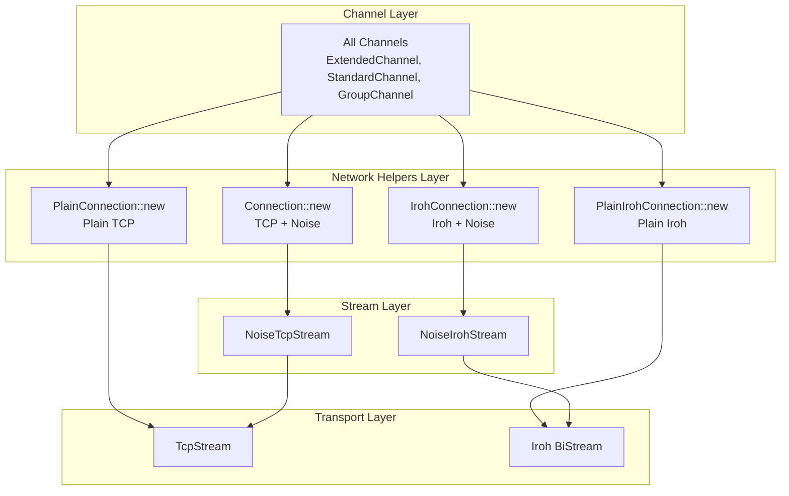

# Design Document

## Overview

This design integrates Iroh peer-to-peer networking as an alternative transport layer for Stratum V2 connections by extending the network-helpers crate. Iroh replaces TCP at the transport layer while maintaining full compatibility with existing channel management logic and providing the same connection interfaces.

The key insight is that Iroh serves as a drop-in replacement for TcpStream, allowing us to maintain the existing layered architecture:
- **NoiseIrohStream**: Equivalent to NoiseTcpStream but using Iroh transport
- **IrohConnection**: Equivalent to Connection but using NoiseIrohStream
- **PlainIrohConnection**: Equivalent to PlainConnection but using Iroh directly

All connection types return the same `(Receiver<StandardEitherFrame<Message>>, Sender<StandardEitherFrame<Message>>)` interface, ensuring zero changes are needed in channels-sv2 or any higher-level code.

## Architecture

### Transport Layer Replacement



### Key Design Principles

1. **Transport Replacement**: Iroh replaces TcpStream at the lowest level
2. **Interface Compatibility**: All connection types return identical interfaces
3. **Zero Channel Changes**: Existing channel logic remains completely unchanged
4. **Encryption Support**: Noise encryption works over both TCP and Iroh
5. **Transport Selection**: Roles choose transport through connection constructor selection

## Components

### NoiseIrohStream

Equivalent to NoiseTcpStream but using Iroh as the transport layer:

```rust
// roles/roles-utils/network-helpers/src/iroh_stream.rs

pub struct NoiseIrohStream<Message> {
    reader: NoiseIrohReadHalf<Message>,
    writer: NoiseIrohWriteHalf<Message>,
}

pub struct NoiseIrohReadHalf<Message> {
    reader: iroh::endpoint::RecvStream,  // Instead of OwnedReadHalf
    decoder: StandardNoiseDecoder<Message>,
    state: State,
    current_frame_buf: Vec<u8>,
    bytes_read: usize,
}

pub struct NoiseIrohWriteHalf<Message> {
    writer: iroh::endpoint::SendStream,  // Instead of OwnedWriteHalf
    encoder: NoiseEncoder<Message>,
    state: State,
}

impl<Message> NoiseIrohStream<Message> {
    pub async fn new(
        iroh_node: Arc<iroh::Node>,
        peer_id: iroh::NodeId,
        alpn: &[u8],
        role: HandshakeRole,
    ) -> Result<Self, Error> {
        // 1. Establish Iroh connection
        let conn = iroh_node.endpoint().connect(peer_id, alpn).await?;
        let (send_stream, recv_stream) = conn.open_bi().await?;
        
        // 2. Perform same Noise handshake as NoiseTcpStream
        // (identical logic, just over Iroh streams instead of TCP)
    }
}
```

### IrohConnection

Equivalent to noise_connection.rs but using NoiseIrohStream:

```rust
// roles/roles-utils/network-helpers/src/iroh_connection.rs

pub struct IrohConnection;

impl IrohConnection {
    pub async fn new<Message>(
        iroh_node: Arc<iroh::Node>,
        peer_id: iroh::NodeId,
        alpn: &[u8],
        role: HandshakeRole,
    ) -> Result<
        (
            Receiver<StandardEitherFrame<Message>>,
            Sender<StandardEitherFrame<Message>>,
        ),
        Error,
    > {
        // Same pattern as Connection::new but using NoiseIrohStream
        let (sender_incoming, receiver_incoming) = unbounded();
        let (sender_outgoing, receiver_outgoing) = unbounded();

        let (read_half, write_half) = NoiseIrohStream::<Message>::new(
            iroh_node, peer_id, alpn, role
        ).await?.into_split();

        // Same spawn_reader/spawn_writer pattern as noise_connection.rs
        Self::spawn_reader(read_half, /* ... */);
        Self::spawn_writer(write_half, /* ... */);

        Ok((receiver_incoming, sender_outgoing))
    }
}
```

### PlainIrohConnection

Equivalent to plain_connection.rs but using Iroh directly:

```rust
// roles/roles-utils/network-helpers/src/plain_iroh_connection.rs

pub struct PlainIrohConnection;

impl PlainIrohConnection {
    pub async fn new<Message>(
        iroh_node: Arc<iroh::Node>,
        peer_id: iroh::NodeId,
        alpn: &[u8],
    ) -> Result<
        (
            Receiver<StandardEitherFrame<Message>>,
            Sender<StandardEitherFrame<Message>>,
        ),
        Error,
    > {
        // Establish Iroh connection
        let conn = iroh_node.endpoint().connect(peer_id, alpn).await?;
        let (send_stream, recv_stream) = conn.open_bi().await?;
        
        // Same async task pattern as plain_connection.rs
        // but using Iroh streams instead of TCP
    }
}
```

### IrohNodeManager

Manages Iroh node lifecycle and configuration:

```rust
// roles/roles-utils/network-helpers/src/iroh_node.rs

#[derive(Debug, Clone)]
pub struct IrohNodeConfig {
    pub storage_path: Option<PathBuf>,
    pub relay_servers: Vec<String>,
    pub stun_servers: Vec<String>,
    pub bind_port: Option<u16>,
}

pub struct IrohNodeManager {
    node: Arc<iroh::Node>,
    config: IrohNodeConfig,
}

impl IrohNodeManager {
    pub async fn new(config: IrohNodeConfig) -> Result<Self, Error>;
    pub fn node(&self) -> &Arc<iroh::Node>;
    pub fn node_id(&self) -> iroh::NodeId;
    
    // Server-side: accept incoming connections
    pub async fn accept_connection<Message>(
        &self,
        alpn: &[u8],
    ) -> Result<
        (
            Receiver<StandardEitherFrame<Message>>,
            Sender<StandardEitherFrame<Message>>,
        ),
        Error,
    >;
}
```

## Transport Selection Matrix

| Connection Type | Transport | Encryption | Interface |
|----------------|-----------|------------|-----------|
| `Connection::new()` | TCP | Noise | `(Receiver, Sender)` |
| `PlainConnection::new()` | TCP | None | `(Receiver, Sender)` |
| `IrohConnection::new()` | Iroh | Noise | `(Receiver, Sender)` |
| `PlainIrohConnection::new()` | Iroh | None | `(Receiver, Sender)` |

## Usage Patterns

### In Roles

Roles choose transport by selecting the appropriate connection constructor:

```rust
// Pool accepting TCP connections (existing)
let (receiver, sender) = Connection::new(tcp_stream, handshake_role).await?;

// Pool accepting Iroh connections (new)
let (receiver, sender) = IrohConnection::new(iroh_node, peer_id, alpn, handshake_role).await?;

// Both return identical interfaces - existing channel logic unchanged
let downstream = Downstream::new(receiver, sender, /* ... */);
```

### Client-Side Configuration-Based Selection

```rust
// Client establishing outbound connection (e.g., JD Client to JD Server)
match upstream_config {
    UpstreamConfig::Tcp { address } => {
        let stream = TcpStream::connect(address).await?;
        Connection::new(stream, role).await?
    }
    UpstreamConfig::Iroh { node_config, peer_id, alpn } => {
        let node_manager = IrohNodeManager::new(node_config).await?;
        IrohConnection::new(node_manager.node(), peer_id, &alpn, role).await?
    }
    UpstreamConfig::IrohWithTcpFallback { iroh_config, tcp_config } => {
        // Try Iroh first, fallback to TCP on failure
        establish_connection_with_fallback(iroh_config, tcp_config).await?
    }
}
```

### Server-Side Dual Transport Support

Servers can listen on both TCP and Iroh simultaneously (no fallback):

```rust
// Pool supporting both TCP and Iroh simultaneously
async fn start_pool_server(config: &PoolConfig) {
    // TCP listener (if configured)
    if let Some(tcp_config) = &config.tcp {
        tokio::spawn(async move {
            let tcp_listener = TcpListener::bind(&tcp_config.address).await?;
            loop {
                let (stream, _) = tcp_listener.accept().await?;
                let (receiver, sender) = Connection::new(stream, role).await?;
                handle_downstream(receiver, sender).await;
            }
        });
    }

    // Iroh listener (if configured) - independent of TCP
    if let Some(iroh_config) = &config.iroh {
        tokio::spawn(async move {
            let node_manager = IrohNodeManager::new(iroh_config.clone()).await?;
            loop {
                let (receiver, sender) = node_manager
                    .accept_connection(&iroh_config.alpn).await?;
                handle_downstream(receiver, sender).await;
            }
        });
    }
}

// Same downstream handling function works for both transports
async fn handle_downstream(
    receiver: Receiver<StandardEitherFrame<Message>>,
    sender: Sender<StandardEitherFrame<Message>>,
) {
    // Identical logic regardless of transport
    let downstream = Downstream::new(receiver, sender, /* ... */);
    // ... rest of downstream handling
}
```

## Error Handling

### Iroh-Specific Errors

```rust
#[derive(Debug, thiserror::Error)]
pub enum IrohError {
    #[error("Iroh node initialization failed: {0}")]
    NodeInitialization(#[from] iroh::node::Error),
    
    #[error("Connection to peer {peer_id} failed: {source}")]
    ConnectionFailed {
        peer_id: iroh::NodeId,
        #[source]
        source: iroh::endpoint::ConnectError,
    },
    
    #[error("Peer discovery failed for {peer_id}: {reason}")]
    PeerDiscoveryFailed {
        peer_id: iroh::NodeId,
        reason: String,
    },
}
```

### Client-Side Transport Fallback

Fallback only applies to clients establishing outbound connections:

```rust
// Client-side connection with fallback (e.g., JD Client connecting to JD Server)
async fn establish_upstream_connection(config: &ClientConfig) -> Result<Connection, Error> {
    // Try Iroh first if configured
    if let Some(iroh_config) = &config.iroh {
        match IrohConnection::new(
            iroh_node, 
            iroh_config.peer_id, 
            &iroh_config.alpn, 
            role
        ).await {
            Ok(conn) => return Ok(conn),
            Err(e) => {
                warn!("Iroh connection failed, falling back to TCP: {}", e);
            }
        }
    }
    
    // Fallback to TCP
    let stream = TcpStream::connect(&config.tcp_address).await?;
    Connection::new(stream, role).await
}

// Server-side: No fallback - servers listen on configured transports
async fn start_server_listeners(config: &ServerConfig) {
    // TCP listener (if configured)
    if let Some(tcp_config) = &config.tcp {
        tokio::spawn(accept_tcp_connections(tcp_config));
    }
    
    // Iroh listener (if configured) - separate from TCP, no fallback
    if let Some(iroh_config) = &config.iroh {
        tokio::spawn(accept_iroh_connections(iroh_config));
    }
}
```

## Implementation Strategy

### Phase 1: Core Iroh Transport
1. Add Iroh dependencies to network-helpers
2. Implement NoiseIrohStream (equivalent to NoiseTcpStream)
3. Implement IrohConnection (equivalent to Connection)
4. Implement PlainIrohConnection (equivalent to PlainConnection)

### Phase 2: Node Management
1. Implement IrohNodeManager for node lifecycle
2. Add server-side connection acceptance
3. Add configuration validation and error handling

### Phase 3: Role Integration
1. Update role configurations to support Iroh transport
2. Update roles to use Iroh connections when configured
3. Add dual transport support (TCP + Iroh simultaneously)

### Phase 4: Production Features
1. Add comprehensive error handling and logging
2. Add transport fallback mechanisms
3. Create configuration examples and documentation