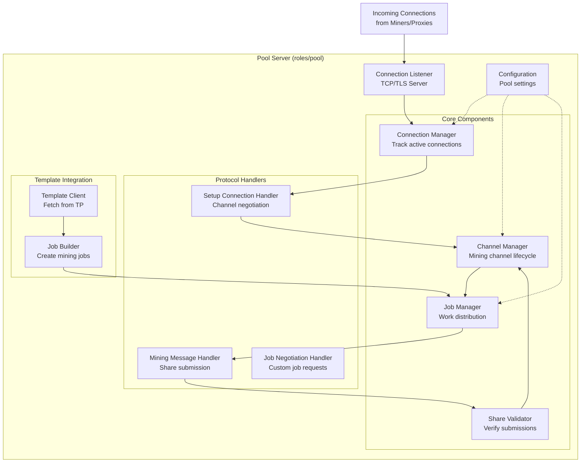

# Pool Role Components

The Pool Server is the most complex role in SRI, managing connections from multiple miners and proxies, distributing work, and coordinating block template distribution.

## Component Diagram



## Component Descriptions

### Connection Listener
**Responsibilities:**
- Listen on configured TCP/TLS port
- Accept incoming connections from miners and proxies
- Perform TLS handshake if encryption is enabled
- Hand off connections to Connection Manager

**Key Technologies:**
- Tokio async TCP listener
- Optional Noise protocol for encryption

### Connection Manager
**Responsibilities:**
- Track all active connections
- Maintain connection metadata (IP, connected time, etc.)
- Handle connection lifecycle (established, active, closed)
- Enforce connection limits
- Clean up dead connections

**State Maintained:**
- Map of connection ID → connection state
- Connection statistics
- Authentication status

### Channel Manager
**Responsibilities:**
- Manage mining channel lifecycle
- Handle channel opening requests
- Assign unique channel IDs
- Track channel state (opening, active, closed)
- Support multiple channels per connection

**SV2 Concepts:**
- **Standard Channel**: Basic mining channel
- **Extended Channel**: Supports job negotiation
- **Group Channel**: Multiple sub-channels under one parent

### Job Manager
**Responsibilities:**
- Receive templates from Template Client
- Build mining jobs from templates
- Set target difficulty per channel
- Distribute jobs to active channels
- Track active jobs for share validation

**Job Lifecycle:**
1. Receive template from Template Provider
2. Create job with appropriate difficulty
3. Assign job to channels
4. Track until new job or timeout

### Share Validator
**Responsibilities:**
- Validate submitted shares meet difficulty target
- Check share is for current job
- Detect duplicate shares
- Verify Proof of Work

**Validation Steps:**
1. Check share references valid job
2. Verify nonce and extra nonce
3. Calculate share hash
4. Compare against target difficulty
5. Check for duplicates

### Setup Connection Handler
**Responsibilities:**
- Process `SetupConnection` messages
- Negotiate protocol version
- Establish channel parameters
- Send `SetupConnection.Success` response

**Protocol Flow:**
```
Miner                          Pool
  |                              |
  |--- SetupConnection --------> |
  |                              | (validate version, flags)
  | <-- SetupConnection.Success -|
  |                              |
  |--- OpenChannel ------------> |
  |                              | (create channel)
  | <-- OpenChannel.Success -----|
```

### Mining Message Handler
**Responsibilities:**
- Process mining-related messages:
  - `SubmitShares`
  - `SetNewPrevHash`
  - `NewMiningJob`
- Route messages to appropriate components
- Generate and send responses

### Job Negotiation Handler
**Responsibilities:**
- Handle job negotiation protocol for extended channels
- Allow miners to propose custom transactions
- Validate proposed templates
- Enable decentralized transaction selection

**Use Case:**
Miners who want to include specific transactions (e.g., payout to themselves) can negotiate custom jobs rather than accepting pool-assigned work.

### Template Client
**Responsibilities:**
- Connect to Template Provider
- Request block templates
- Handle template updates
- Manage connection to TP

**Communication:**
Uses Template Distribution protocol to receive:
- `NewTemplate`
- `SetNewPrevHash`
- Template coinbase outputs

### Job Builder
**Responsibilities:**
- Convert templates into mining jobs
- Calculate merkle branches
- Set coinbase transaction
- Prepare job metadata

**Output:**
Produces `NewMiningJob` or `NewExtendedMiningJob` messages ready for distribution.

## Data Flow

### New Template Flow
```
Template Provider → Template Client → Job Builder → Job Manager → Channels → Miners
```

### Share Submission Flow
```
Miner → Mining Handler → Share Validator → Channel Manager
                                    ↓
                              (if valid block)
                                    ↓
                           Submit to Bitcoin Network
```

## Configuration

Key configuration parameters:
- **Listen address**: IP and port for incoming connections
- **Max connections**: Connection limit
- **Difficulty window**: Share difficulty adjustment period
- **Template provider address**: Where to fetch templates
- **Coinbase outputs**: Pool payout addresses

## Related Code

- `roles/pool/src/lib/` - Main pool implementation
- `protocols/v2/subprotocols/mining/` - Mining protocol messages
- `protocols/v2/subprotocols/job-negotiation/` - Job negotiation messages

---

Back to: [Components Overview](../components.md)
