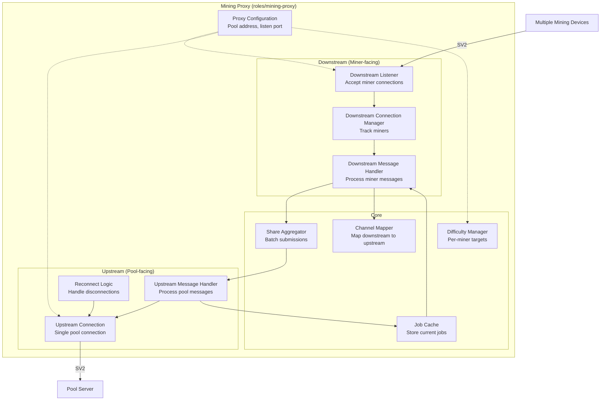

# Mining Proxy Components

The Mining Proxy aggregates connections from multiple downstream mining devices into a single upstream connection to a pool, reducing bandwidth and simplifying pool infrastructure.

## Component Diagram



## Component Descriptions

### Downstream Listener
**Responsibilities:**
- Listen for incoming miner connections
- Accept multiple concurrent connections
- Perform SV2 handshake with each miner
- Hand connections to Downstream Connection Manager

**Configuration:**
- Bind address and port
- TLS/Noise encryption settings
- Maximum concurrent connections

### Downstream Connection Manager
**Responsibilities:**
- Track all connected miners
- Maintain per-miner state
- Handle miner disconnections
- Enforce connection limits

**State Per Miner:**
- Connection metadata
- Assigned difficulty
- Active channels
- Submission statistics

### Downstream Message Handler
**Responsibilities:**
- Receive and parse SV2 messages from miners
- Route messages to appropriate components
- Generate responses for miners
- Distribute jobs from cache to miners

**Handled Message Types:**
- `SetupConnection` - Initial handshake
- `OpenStandardMiningChannel` - Channel setup
- `SubmitSharesStandard` - Share submissions
- `SetCustomMiningJob` (if supported)

### Upstream Connection
**Responsibilities:**
- Maintain single connection to pool
- Handle SV2 protocol with pool
- Authenticate with pool
- Manage upstream channel

**Connection Lifecycle:**
1. Connect to pool
2. Setup connection (version negotiation)
3. Open aggregated channel
4. Maintain connection
5. Reconnect on failure

### Upstream Message Handler
**Responsibilities:**
- Process messages from pool
- Update job cache with new work
- Handle difficulty adjustments
- Propagate pool state to miners

**Handled Message Types:**
- `SetupConnection.Success`
- `OpenStandardMiningChannel.Success`
- `NewMiningJob` - New work from pool
- `SetNewPrevHash` - Block found, update work
- `SetTarget` - Difficulty changes

### Job Cache
**Responsibilities:**
- Store current mining jobs from pool
- Serve jobs to newly connected miners
- Track job validity periods
- Handle job transitions

**Operations:**
- **Add**: New job from pool
- **Get**: Retrieve current job for miner
- **Expire**: Remove old jobs
- **Update**: Handle prev hash changes

### Share Aggregator
**Responsibilities:**
- Collect shares from multiple miners
- Batch submissions to reduce upstream messages
- Filter low-difficulty shares
- Forward only pool-difficulty shares

**Aggregation Strategy:**
- **Immediate**: Submit shares meeting pool difficulty immediately
- **Batched**: Group and submit multiple shares together (optional)
- **Filtered**: Only submit shares meeting pool target

### Channel Mapper
**Responsibilities:**
- Map downstream channels to upstream channel
- Translate channel IDs between miners and pool
- Track which miner submitted which share
- Route responses to correct miner

**Mapping:**
```
Downstream Channels        Upstream Channel
Miner1: Channel 1 ----\
Miner2: Channel 2 -----+---> Pool: Aggregated Channel 1
Miner3: Channel 3 ----/
```

### Difficulty Manager
**Responsibilities:**
- Set per-miner difficulty targets
- Adjust difficulty based on miner hashrate
- Ensure miners submit appropriate share rate
- Balance fairness and efficiency

**Adjustment Algorithm:**
1. Track miner submission rate
2. Calculate target rate (e.g., 1 share/10s)
3. Adjust difficulty to achieve target rate
4. Send `SetTarget` to miner

### Reconnect Logic
**Responsibilities:**
- Detect upstream connection failures
- Implement backoff strategy
- Reconnect to pool
- Resume operation after reconnection

**Strategy:**
- Exponential backoff (1s, 2s, 4s, 8s, max 60s)
- Maintain miner connections during reconnection
- Resume with cached jobs if possible

## Data Flows

### Job Distribution Flow
```
Pool → Upstream Connection → Job Cache → Downstream Handler → Miners
```

### Share Submission Flow
```
Miner → Downstream Handler → Share Aggregator → Upstream Handler → Pool
```

### Difficulty Adjustment Flow
```
Pool → Upstream Handler → Difficulty Manager → Downstream Handler → Miner
```

## Benefits of Proxying

### Bandwidth Reduction
- Single upstream connection vs. hundreds of miner connections
- Share aggregation reduces message count
- Job caching eliminates duplicate transmissions

### Pool Infrastructure
- Pool handles fewer connections
- Reduced load on pool servers
- Easier scaling for pool operators

### Miner Experience
- Local proxy provides fast response times
- Continues operating during brief pool disconnections (using cached jobs)
- Can apply custom difficulty per miner

## Configuration Example

```toml
[proxy]
listen_address = "0.0.0.0:34255"
upstream_address = "pool.example.com:34254"
max_downstream_connections = 1000
upstream_reconnect_delay = 5

[difficulty]
starting_difficulty = 1024
adjustment_interval = 300
target_share_rate = 10
```

## Related Code

- `roles/mining-proxy/src/lib/` - Proxy implementation
- `roles/roles-utils/network-helpers/` - Connection utilities
- `protocols/v2/subprotocols/mining/` - Mining protocol messages

---

Back to: [Components Overview](../components.md)
