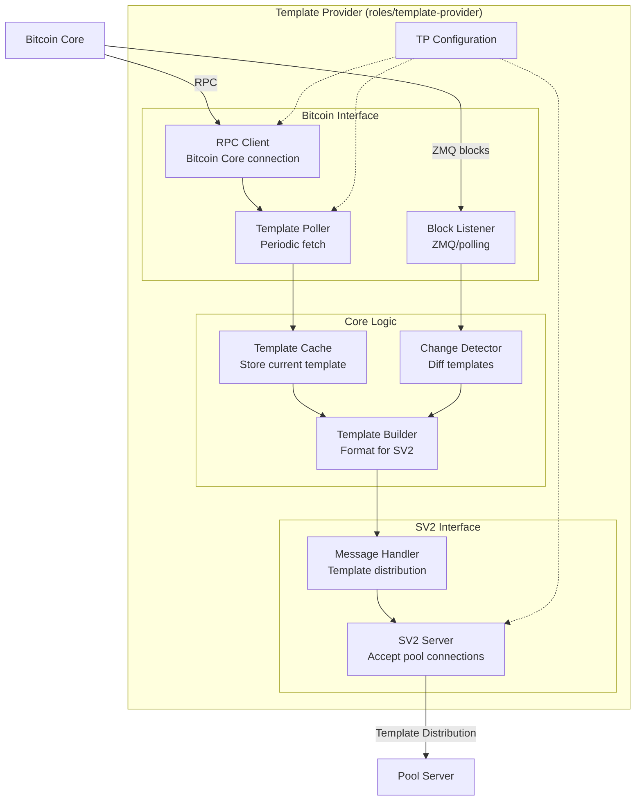

# Template Provider Components

The Template Provider acts as a bridge between Bitcoin Core and the SV2 pool, fetching block templates and distributing them to enable decentralized transaction selection.

## Component Diagram



## Component Descriptions

### RPC Client
**Responsibilities:**
- Connect to Bitcoin Core RPC interface
- Execute `getblocktemplate` requests
- Authenticate with RPC credentials
- Handle connection errors and retries

**Configuration:**
- RPC URL (e.g., `http://127.0.0.1:8332`)
- RPC username and password
- Timeout settings

**Key RPC Calls:**
```rust
// Fetch block template
getblocktemplate({
    "rules": ["segwit", "taproot"]
})

// Returns:
{
    "version": 536870912,
    "previousblockhash": "...",
    "transactions": [...],
    "coinbasevalue": 625000000,
    "target": "...",
    ...
}
```

### Template Poller
**Responsibilities:**
- Periodically poll Bitcoin Core for new templates
- Detect when template has changed
- Trigger template distribution
- Implement intelligent polling intervals

**Polling Strategy:**
- **Fast poll**: Every 1-5 seconds when mempool active
- **Slow poll**: Every 30 seconds when inactive
- **Immediate poll**: On new block notification

### Block Listener
**Responsibilities:**
- Subscribe to Bitcoin Core ZMQ notifications
- Detect new blocks on network
- Trigger immediate template refresh
- Update `prevhash` for mining

**ZMQ Subscription:**
```rust
// Subscribe to block notifications
zmq_subscribe("tcp://127.0.0.1:28332", "hashblock")

// On notification:
// 1. New block detected
// 2. Fetch new template
// 3. Send SetNewPrevHash to pool
```

### Template Cache
**Responsibilities:**
- Store current block template
- Track template metadata
- Provide template for distribution
- Handle template versioning

**Cached Data:**
- Full block template from Bitcoin Core
- Template ID
- Timestamp
- Transaction list
- Coinbase value

### Template Builder
**Responsibilities:**
- Convert Bitcoin Core template to SV2 format
- Build `NewTemplate` message
- Extract relevant fields
- Calculate merkle paths

**Conversion Process:**
1. Extract transactions from template
2. Build coinbase transaction
3. Calculate merkle root
4. Format as SV2 `NewTemplate` message

**SV2 NewTemplate Message:**
```rust
NewTemplate {
    template_id: u64,
    future_template: bool,
    version: u32,
    coinbase_tx_version: u32,
    coinbase_prefix: Vec<u8>,
    coinbase_tx_input_sequence: u32,
    coinbase_tx_value_remaining: u64,
    coinbase_tx_outputs_count: u32,
    coinbase_tx_outputs: Vec<u8>,
    coinbase_tx_locktime: u32,
    merkle_path: Vec<[u8; 32]>,
}
```

### Change Detector
**Responsibilities:**
- Compare new template with cached version
- Detect what changed (transactions, prevhash, etc.)
- Optimize message sending
- Send incremental updates when possible

**Change Types:**
- **New block**: `prevhash` changed → Send `SetNewPrevHash`
- **New transactions**: Transaction set changed → Send `NewTemplate`
- **No change**: Skip sending duplicate template

### SV2 Server Listener
**Responsibilities:**
- Listen for incoming connections from pool
- Accept SV2 connections
- Perform protocol handshake
- Maintain active connections

**Connection Setup:**
1. Accept TCP/TLS connection
2. Perform Noise handshake (if encrypted)
3. Handle `SetupConnection`
4. Await template requests

### Message Handler
**Responsibilities:**
- Send template messages to pool
- Handle `SetNewPrevHash` notifications
- Respond to pool requests
- Manage message sequencing

**Message Types:**
- `NewTemplate` - Full template
- `SetNewPrevHash` - Block found, update prevhash
- `RequestTransactionData` (future) - Send tx data

## Data Flows

### Normal Template Flow
```
Bitcoin Core → RPC Client → Template Poller → Template Cache → Template Builder → Message Handler → Pool
```

### New Block Flow
```
Bitcoin Core ZMQ → Block Listener → Change Detector → Message Handler → Pool
                                                  ↓
                                            SetNewPrevHash
```

## Template Distribution Protocol

### Initial Connection
```
Pool                          Template Provider
  |                                    |
  |--- SetupConnection --------------> |
  | <-- SetupConnection.Success ------ |
  |                                    |
  | <-- NewTemplate ------------------- |
  |                                    |
```

### Template Update
```
Pool                          Template Provider
  |                                    |
  | <-- NewTemplate ------------------- | (mempool changed)
  |                                    |
```

### New Block
```
Pool                          Template Provider
  |                                    |
  | <-- SetNewPrevHash ---------------- | (block found)
  |                                    |
  | <-- NewTemplate ------------------- | (with new prevhash)
  |                                    |
```

## Benefits

### Decentralized Transaction Selection
- Pools don't control transaction selection
- Miners can choose which transactions to include
- Reduces pool censorship risk
- Improves Bitcoin decentralization

### Efficient Updates
- Only send changed data
- Incremental updates save bandwidth
- Fast response to new blocks

### Separation of Concerns
- Bitcoin Core handles consensus
- Template Provider handles distribution
- Pool handles miner coordination

## Configuration Example

```toml
[template_provider]
# Bitcoin Core connection
bitcoin_rpc_url = "http://127.0.0.1:8332"
bitcoin_rpc_user = "bitcoin"
bitcoin_rpc_password = "..."

# ZMQ (optional)
bitcoin_zmq_address = "tcp://127.0.0.1:28332"

# SV2 server
listen_address = "0.0.0.0:8442"
authority_public_key = "..."
authority_secret_key = "..."

# Polling
template_poll_interval = 5
```

## Use Cases

### Standard Pool
Pool uses Template Provider to get templates, then distributes work to miners:
```
Bitcoin Core → Template Provider → Pool → Miners
```

### Job Negotiation Pool
Miners can request custom templates via Job Negotiation protocol:
```
Miner → Pool (job negotiation) → Template Provider → Bitcoin Core
     ← Pool (custom job) ←
```

## Related Code

- `roles/template-provider/src/` - Template Provider implementation
- `utils/rpc-client/` - Bitcoin RPC client
- `protocols/v2/subprotocols/template-distribution/` - Template distribution protocol

## Future Enhancements

- **Transaction caching**: Avoid re-sending known transactions
- **Compact block relay**: Similar to BIP 152
- **Custom template policies**: Filter transactions by fee, size, etc.
- **Multiple Bitcoin nodes**: Fetch templates from multiple nodes for redundancy

---

Back to: [Components Overview](../components.md)
