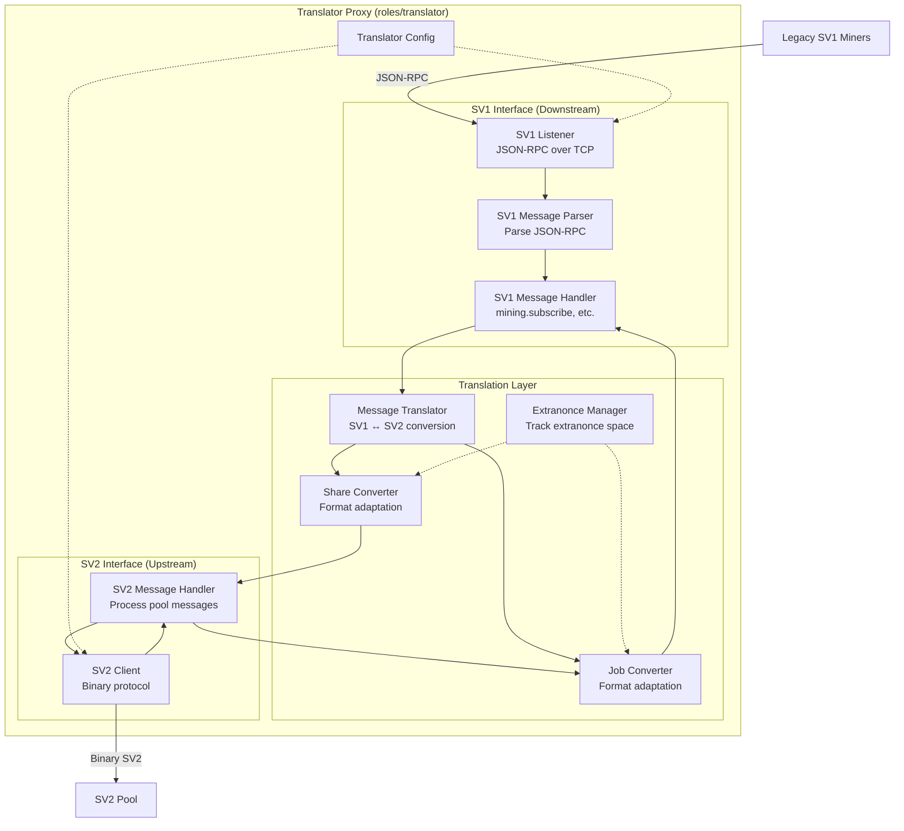

# Translator Proxy Components

The Translator Proxy bridges the gap between legacy Stratum V1 miners and modern Stratum V2 pools, enabling gradual migration without requiring firmware updates.

## Component Diagram



## Component Descriptions

### SV1 Listener
**Responsibilities:**
- Listen on TCP port for SV1 connections
- Accept JSON-RPC connections from legacy miners
- Maintain compatibility with SV1 protocol
- No encryption (SV1 limitation)

**Supported SV1 Methods:**
- `mining.subscribe` - Subscribe to mining notifications
- `mining.authorize` - Authenticate worker
- `mining.submit` - Submit share
- `mining.extranonce.subscribe` - Subscribe to extranonce changes

### SV1 Message Parser
**Responsibilities:**
- Parse incoming JSON-RPC messages
- Validate message structure
- Extract method and parameters
- Handle malformed messages

**Example SV1 Message:**
```json
{
  "id": 1,
  "method": "mining.subscribe",
  "params": ["cgminer/4.10.0"]
}
```

### SV1 Message Handler
**Responsibilities:**
- Route parsed SV1 messages to appropriate handlers
- Generate SV1 JSON-RPC responses
- Send mining notifications to SV1 miners
- Handle SV1 connection lifecycle

**Message Flow:**
1. Receive parsed message from parser
2. Execute method-specific logic
3. Translate to SV2 if needed
4. Generate and send JSON-RPC response

### Message Translator
**Responsibilities:**
- Translate between SV1 and SV2 message formats
- Map SV1 concepts to SV2 equivalents
- Handle protocol differences
- Maintain translation state

**Translation Challenges:**
- **Extranonce space**: SV1 uses extranonce1/2, SV2 uses different mechanism
- **Job format**: Different binary encodings
- **Difficulty**: SV1 uses difficulty, SV2 uses target
- **Connection setup**: Different handshake protocols

### Job Converter
**Responsibilities:**
- Convert SV2 `NewMiningJob` to SV1 `mining.notify`
- Translate binary SV2 job data to SV1 hex strings
- Calculate merkle branches for SV1 format
- Track job IDs across protocols

**SV2 → SV1 Conversion:**
```rust
// SV2 NewMiningJob
{
    channel_id: u32,
    job_id: u32,
    merkle_root: [u8; 32],
    version: u32,
    ...
}

// Converts to SV1 mining.notify
{
    "method": "mining.notify",
    "params": [
        "job_id_hex",
        "prevhash_hex",
        "coinb1_hex",
        "coinb2_hex",
        ["merkle_branch_hex"],
        "version_hex",
        "nbits_hex",
        "ntime_hex",
        clean_jobs
    ]
}
```

### Share Converter
**Responsibilities:**
- Convert SV1 `mining.submit` to SV2 `SubmitSharesStandard`
- Validate share format
- Translate difficulty/target
- Map worker names to channels

**SV1 → SV2 Conversion:**
```rust
// SV1 mining.submit
{
    "method": "mining.submit",
    "params": [
        "worker_name",
        "job_id",
        "extranonce2",
        "ntime",
        "nonce"
    ]
}

// Converts to SV2 SubmitSharesStandard
{
    channel_id: u32,
    sequence_number: u32,
    job_id: u32,
    nonce: u32,
    ntime: u32,
    version: u32
}
```

### Extranonce Manager
**Responsibilities:**
- Manage extranonce space allocation
- Track extranonce1 per miner
- Handle extranonce2 space
- Prevent nonce collision between miners

**Extranonce Allocation:**
- Assign unique extranonce1 to each connected miner
- Miners can iterate extranonce2 space
- Ensures no duplicate work across miners

### SV2 Client
**Responsibilities:**
- Maintain connection to SV2 pool
- Implement SV2 binary protocol
- Handle encrypted communication (Noise protocol)
- Manage upstream channel

**Setup:**
1. Connect to SV2 pool
2. Perform Noise handshake
3. Setup connection (version negotiation)
4. Open standard mining channel
5. Receive jobs and forward to translator

### SV2 Message Handler
**Responsibilities:**
- Process SV2 messages from pool
- Handle setup and mining messages
- Trigger job conversion when new work arrives
- Forward share results back to SV1 miners

## Translation Examples

### Mining Subscription Flow

**SV1 Miner → Translator:**
```json
{"id": 1, "method": "mining.subscribe", "params": ["cgminer/4.10.0"]}
```

**Translator → SV2 Pool:**
```
SetupConnection {
    protocol: Mining,
    min_version: 2,
    max_version: 2,
    ...
}
OpenStandardMiningChannel {
    ...
}
```

**Translator → SV1 Miner:**
```json
{
    "id": 1,
    "result": [
        [["mining.set_difficulty", "deadbeef"], ["mining.notify", "deadbeef"]],
        "extranonce1_hex",
        extranonce2_size
    ],
    "error": null
}
```

### Job Notification Flow

**SV2 Pool → Translator:**
```
NewMiningJob {
    channel_id: 1,
    job_id: 42,
    ...
}
```

**Translator → SV1 Miner:**
```json
{
    "method": "mining.notify",
    "params": ["2a", "prevhash...", "coinb1...", "coinb2...", [], "version", "nbits", "ntime", true]
}
```

## Limitations

The translator cannot provide full SV2 benefits:

- **No encryption**: SV1 protocol is unencrypted
- **No job negotiation**: SV1 miners cannot select transactions
- **Higher latency**: Translation overhead
- **Limited efficiency**: Still uses SV1's less efficient encoding

## Use Cases

- Mining farms with large legacy SV1 deployments
- Temporary migration solution before firmware updates
- Testing SV2 pool infrastructure with existing miners
- Gradual rollout of SV2 adoption

## Configuration Example

```toml
[translator]
# SV1 interface
sv1_listen_address = "0.0.0.0:3333"
sv1_max_connections = 1000

# SV2 upstream
sv2_pool_address = "sv2pool.example.com:34254"
sv2_pool_authority_pubkey = "..."

# Worker authentication
upstream_username = "translator_proxy"
upstream_password = "..."
```

## Related Code

- `roles/translator/src/` - Translator implementation
- `protocols/v1/` - Stratum V1 protocol
- `protocols/v2/` - Stratum V2 protocol

---

Back to: [Components Overview](../components.md)
