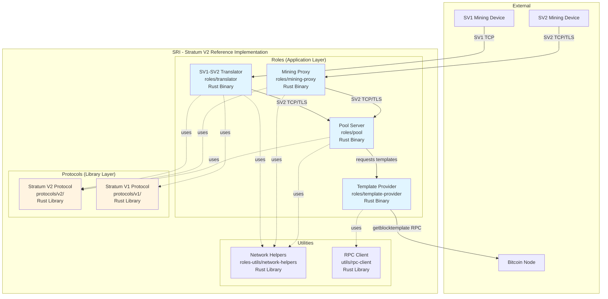

# Containers & Modules

This page describes the high-level architectural containers (major components) that make up the Stratum V2 Reference Implementation.

## C4 Container Diagram

## Container Descriptions

### Application Layer: Roles

#### Pool Server (`roles/pool`)
**Technology**: Rust Binary
**Purpose**: Full-featured Stratum V2 pool implementation

**Responsibilities:**
- Accept connections from miners and proxies
- Distribute mining jobs
- Validate submitted shares
- Coordinate with Template Provider for block templates
- Manage mining channels

**Communication:**
- **Inbound**: SV2 protocol from proxies and miners
- **Outbound**: Requests to Template Provider

#### Mining Proxy (`roles/mining-proxy`)
**Technology**: Rust Binary
**Purpose**: Aggregate multiple miners into a single upstream connection

**Responsibilities:**
- Manage downstream miner connections
- Aggregate share submissions
- Reduce bandwidth to pool
- Provide local job distribution

**Communication:**
- **Inbound**: SV2 from individual mining devices
- **Outbound**: SV2 to pool server

#### Translator Proxy (`roles/translator`)
**Technology**: Rust Binary
**Purpose**: Bridge legacy SV1 miners to SV2 pools

**Responsibilities:**
- Accept SV1 connections from legacy miners
- Translate SV1 messages to SV2 format
- Provide backward compatibility
- Enable gradual migration to SV2

**Communication:**
- **Inbound**: SV1 from legacy miners
- **Outbound**: SV2 to pool or proxy

#### Template Provider (`roles/template-provider`)
**Technology**: Rust Binary
**Purpose**: Fetch and distribute block templates from Bitcoin node

**Responsibilities:**
- Connect to Bitcoin Core RPC
- Request block templates
- Distribute templates to pool
- Enable transaction selection by miners

**Communication:**
- **Inbound**: Requests from pool server
- **Outbound**: RPC calls to Bitcoin node

### Library Layer: Protocols

#### Stratum V2 Protocol (`protocols/v2/`)
**Technology**: Rust Library Crates
**Purpose**: Core SV2 protocol implementation

**Key Modules:**
- `framing-sv2`: Message framing and encoding
- `binary-sv2`: Binary serialization/deserialization
- `noise-sv2`: Noise protocol encryption
- `codec-sv2`: Message codec implementation
- `*-sv2`: Protocol-specific message types (mining, job negotiation, template distribution, etc.)

#### Stratum V1 Protocol (`protocols/v1/`)
**Technology**: Rust Library
**Purpose**: Legacy SV1 protocol support

**Responsibilities:**
- Parse and generate SV1 JSON-RPC messages
- Maintain compatibility with existing miners

### Utility Layer

#### Network Helpers (`roles-utils/network-helpers`)
**Technology**: Rust Library
**Purpose**: Common networking utilities for roles

**Provides:**
- Connection management
- TLS/TCP abstractions
- Noise protocol integration
- Connection pooling

#### RPC Client (`utils/rpc-client`)
**Technology**: Rust Library
**Purpose**: Bitcoin Core RPC client

**Provides:**
- JSON-RPC client for Bitcoin Core
- Template fetching
- Block submission

## Data Flow

### Mining Work Distribution
1. Template Provider fetches block template from Bitcoin node
2. Pool Server receives template and creates mining jobs
3. Jobs are distributed to Proxies (SV2) or Translators (converting to SV1)
4. Mining devices receive work and begin hashing

### Share Submission
1. Miner finds share and submits to Proxy/Translator
2. Proxy/Translator validates and forwards to Pool
3. Pool validates share against current job
4. If share meets block difficulty, Pool submits to Bitcoin network

## Technology Choices

- **Rust**: Memory safety, performance, and concurrency
- **Tokio**: Async runtime for handling thousands of connections
- **Noise Protocol**: Encrypted and authenticated communication
- **Binary Protocol**: Efficient encoding for low bandwidth

---

Next: [Components](./components.md) - Detailed component breakdowns for each role
