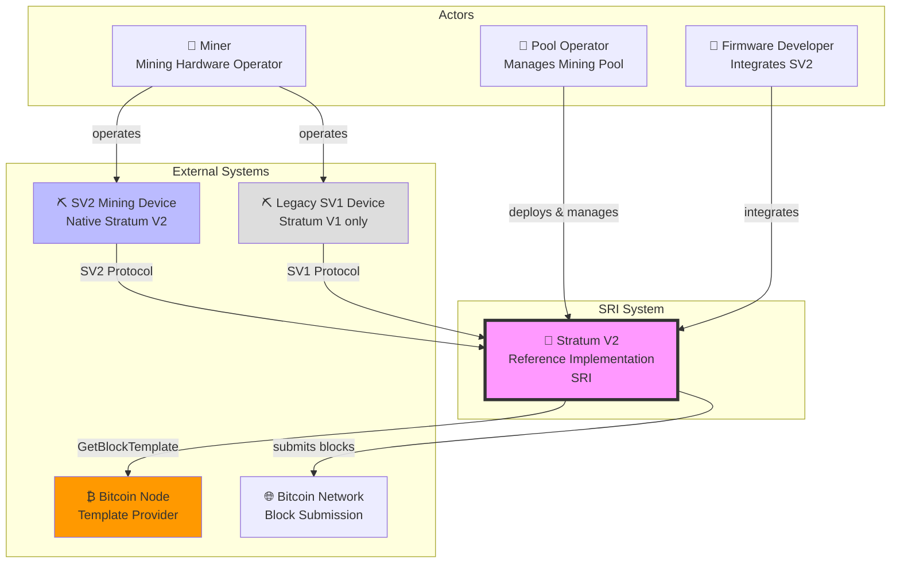

# System Context

This page provides a high-level view of how the Stratum V2 Reference Implementation (SRI) fits into the Bitcoin mining ecosystem.

## C4 Context Diagram

## Key Relationships

### Miners → SRI
- **SV2-native miners** connect directly using the Stratum V2 protocol
- **Legacy SV1 miners** connect through SRI's translator proxy, which converts SV1 to SV2
- Miners submit shares and receive work assignments

### SRI → Bitcoin Node
- SRI acts as a Template Provider client
- Requests block templates via `getblocktemplate` RPC
- Enables miners to construct their own blocks (optional)

### SRI → Bitcoin Network
- Submits valid blocks found by miners
- Propagates blocks to the network

### Pool Operators
- Deploy and configure SRI components
- Manage miner connections and payouts
- Monitor pool performance

### Firmware Developers
- Use SRI protocol libraries to integrate SV2 into mining firmware
- Leverage Rust crates for protocol handling
- Contribute to improving the reference implementation

## System Responsibilities

The SRI system is responsible for:

1. **Protocol Translation**: Converting between SV1 and SV2 when necessary
2. **Connection Management**: Handling thousands of concurrent miner connections
3. **Work Distribution**: Efficiently distributing mining jobs to connected miners
4. **Share Validation**: Verifying submitted shares meet difficulty requirements
5. **Template Management**: Fetching and distributing block templates
6. **Security**: Encrypted connections and authenticated messages

## Boundaries

**Inside the SRI system:**
- Pool server implementations
- Proxy implementations (standard and translator)
- Protocol library crates
- Job negotiation logic

**Outside the SRI system:**
- Bitcoin Core or other Bitcoin nodes
- Mining device firmware (though SRI can be integrated into it)
- Payout and accounting systems
- Pool frontend/dashboard applications

---

Next: [Containers & Modules](./containers.md) - Dive into the high-level architecture of SRI
