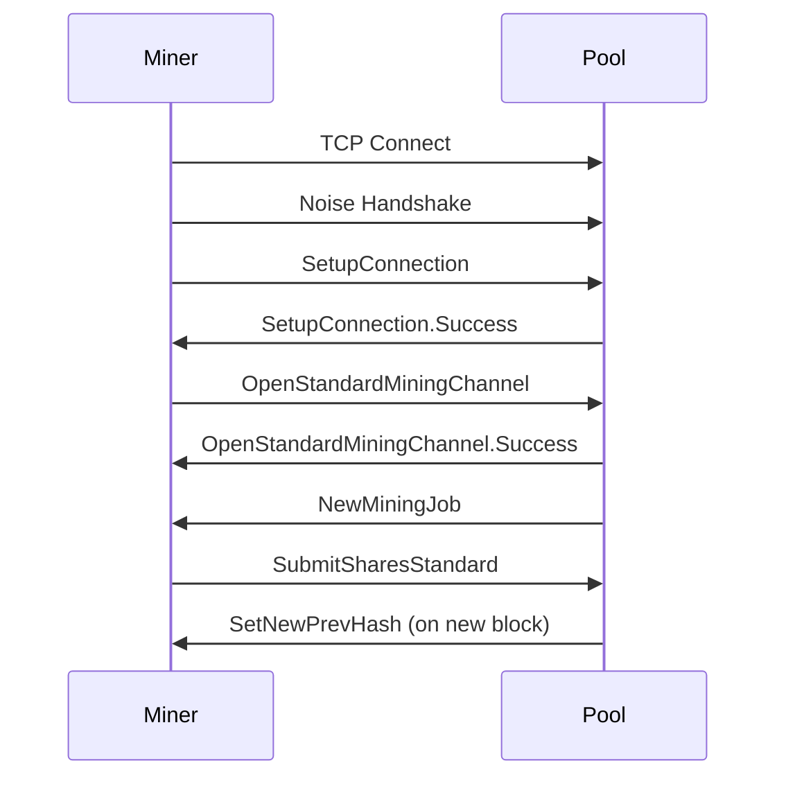

# Connection Flow

This page describes the connection lifecycle and message flows in Stratum V2.

> **Note**: This page is a work in progress. Detailed flows will be added as the documentation evolves.

## Standard Miner Connection

## Topics to be covered:

- Initial connection & handshake
- Channel opening
- Job reception
- Share submission
- Difficulty adjustment
- Reconnection handling
- Error scenarios

---

More details coming soon!
