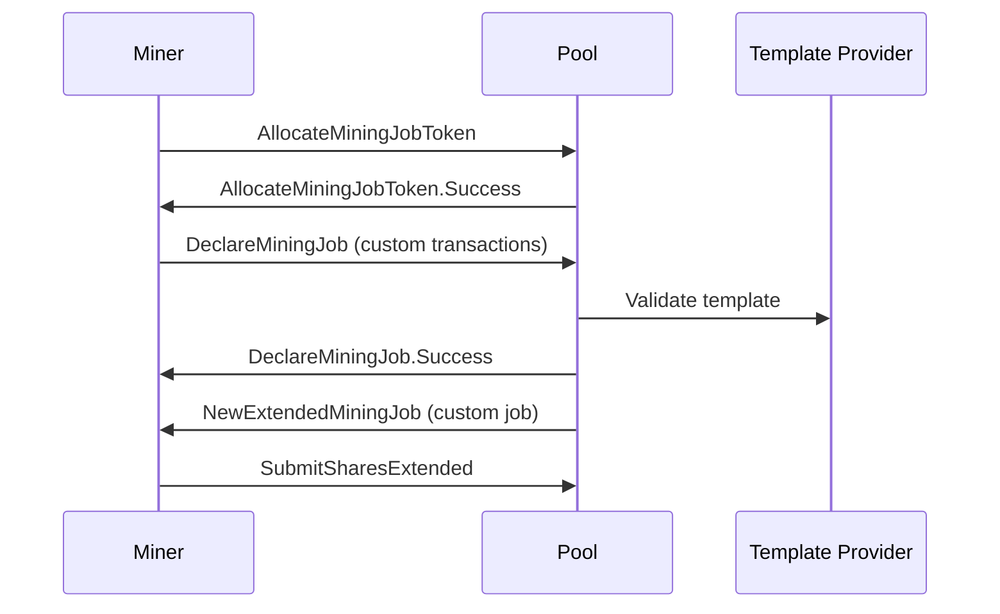

# Job Negotiation

Job negotiation enables miners to select their own transactions, promoting decentralization in Bitcoin mining.

> **Note**: This page is a work in progress. Detailed workflows will be added as the documentation evolves.

## Why Job Negotiation?

Traditional mining pools control transaction selection, which creates centralization risks:
- Pools can censor transactions
- Miners have no say in block content
- Reduces Bitcoin's censorship resistance

Job negotiation solves this by allowing miners to propose their own block templates.

## High-Level Flow

## Topics to be covered:

- Opening extended channels
- Requesting job tokens
- Declaring custom jobs
- Transaction identification
- Providing missing transactions
- Handling rejections
- Best practices

---

More details coming soon!
