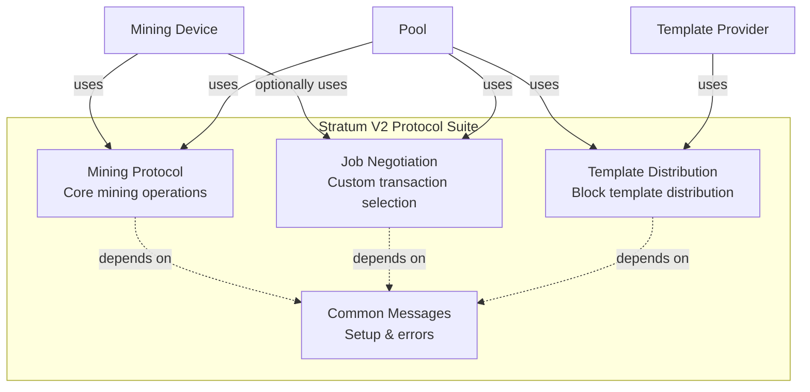

# Stratum V2 Overview

Stratum V2 is a major upgrade to the original Stratum mining protocol, addressing efficiency, security, and decentralization concerns in Bitcoin mining.

## Key Improvements Over SV1

### 1. Binary Protocol
**SV1**: JSON-RPC text format
**SV2**: Efficient binary encoding

**Benefits:**
- ~3x bandwidth reduction
- Faster parsing
- Lower CPU overhead
- Better performance at scale

### 2. Encryption & Authentication
**SV1**: Unencrypted, unauthenticated
**SV2**: Noise protocol encryption

**Benefits:**
- Prevents man-in-the-middle attacks
- Protects hashrate theft
- Secure communication
- Optional: can use plain TCP for trusted networks

### 3. Job Negotiation
**SV1**: Pool dictates all transactions
**SV2**: Miners can negotiate custom jobs

**Benefits:**
- Decentralized transaction selection
- Reduces pool censorship
- Miners can include specific transactions
- Improves Bitcoin decentralization

### 4. Multiplexing & Channels
**SV1**: One connection per device
**SV2**: Multiple channels over single connection

**Benefits:**
- Reduced connection overhead
- Better resource utilization
- Easier proxy implementation
- Scalable infrastructure

## Protocol Architecture

### Subprotocols

Stratum V2 consists of multiple subprotocols for different purposes:



#### Mining Protocol
Core protocol for work distribution and share submission:
- `NewMiningJob` - Distribute work
- `SetNewPrevHash` - Update for new block
- `SubmitSharesStandard` - Submit found shares
- `SetTarget` - Adjust difficulty

#### Job Negotiation Protocol
Allows miners to propose custom block templates:
- `AllocateMiningJobToken` - Request job token
- `DeclareMiningJob` - Propose custom job
- `ProvideMissingTransactions` - Send custom transactions

#### Template Distribution Protocol
Distributes block templates from Bitcoin node:
- `NewTemplate` - New block template
- `SetNewPrevHash` - Block found notification
- `RequestTransactionData` - Request tx details

#### Common Messages
Shared across all subprotocols:
- `SetupConnection` - Protocol version negotiation
- `OpenChannel` - Create mining channel
- `ChannelEndpointChanged` - Update connection details

## Message Structure

### Frame Format

All SV2 messages use a common frame structure:

```
+------------------+------------------+------------------+
| Extension (2B)   | Message Type (1B)| Message Length (3B)|
+------------------+------------------+------------------+
| Payload (variable length)                             |
+-------------------------------------------------------+
```

**Fields:**
- **Extension**: Flags for future extensions
- **Message Type**: Identifies message (e.g., 0x01 = NewMiningJob)
- **Message Length**: Payload length in bytes (up to 16MB)
- **Payload**: Binary-encoded message data

### Binary Encoding

SV2 uses efficient binary encoding:

| Type | Size | Description |
|------|------|-------------|
| `U8` | 1 byte | Unsigned 8-bit integer |
| `U16` | 2 bytes | Unsigned 16-bit integer (LE) |
| `U32` | 4 bytes | Unsigned 32-bit integer (LE) |
| `U256` | 32 bytes | 256-bit value (e.g., hashes) |
| `BOOL` | 1 byte | Boolean (0x00 or 0x01) |
| `B0_255` | variable | Byte array (length prefix) |
| `STR0_255` | variable | UTF-8 string (length prefix) |

**Example: NewMiningJob Message**
```
0x01 0x02 0x03 0x04  // channel_id (U32)
0x2a 0x00 0x00 0x00  // job_id (U32) = 42
0x01                 // future_job (BOOL) = true
... (more fields)
```

## Channel Types

### Standard Channel
Basic mining channel for most miners:
- Single mining target
- No job negotiation
- Minimal overhead
- Suitable for hardware miners

### Extended Channel
Advanced channel supporting custom jobs:
- Job negotiation support
- Custom transaction selection
- Variable target
- Suitable for software miners, pools

### Group Channel
Aggregates multiple sub-channels:
- Used by proxies
- Reduces connection count
- Efficient for large farms
- Sub-channels share configuration

## Security: Noise Protocol

SV2 uses the Noise Protocol Framework for encryption:

**Handshake**: `Noise_NX_25519_ChaChaPoly_BLAKE2s`

- **NX pattern**: Server authentication, client anonymous
- **25519**: Elliptic curve Diffie-Hellman
- **ChaChaPoly**: Authenticated encryption
- **BLAKE2s**: Hash function

**Benefits:**
- Forward secrecy
- Mutual authentication (optional)
- Efficient encryption
- Battle-tested framework

## Backwards Compatibility

### SV1 Compatibility
SV2 is **not** directly compatible with SV1:
- Different message formats
- Different protocols
- Different connection setup

**Solution**: Translator proxy bridges SV1 and SV2

### Migration Path
1. Deploy SV2 pool with translator support
2. Connect SV1 miners through translator
3. Gradually upgrade miners to native SV2
4. Eventually deprecate translator

## Protocol Extensions

SV2 is designed for extensibility:

**Extension Bits**: Reserved in frame header
- Future protocol versions
- Optional features
- Backwards-compatible additions

**Version Negotiation**: During `SetupConnection`
- Client proposes version range
- Server accepts compatible version
- Ensures interoperability

## Performance Characteristics

### Bandwidth
- **SV1**: ~500 bytes per job (JSON)
- **SV2**: ~150 bytes per job (binary)
- **Reduction**: ~70% bandwidth savings

### Latency
- Binary parsing: ~10x faster than JSON
- Encryption overhead: <1ms
- Overall: Lower latency than SV1

### Scalability
- Single pool connection: 100,000+ miners via proxies
- Channel multiplexing: Reduces connection count
- Efficient resource usage: Lower CPU/memory per miner

## Related Specifications

Official Stratum V2 specifications:
- [SV2 Specification Repository](https://github.com/stratum-mining/sv2-spec)
- [Protocol Documentation](https://stratumprotocol.org/specification)

---

Next:
- [Message Types](./message-types.md) - Detailed message reference
- [Connection Flow](./connection-flow.md) - Connection lifecycle
- [Job Negotiation](./job-negotiation.md) - Custom job workflow
